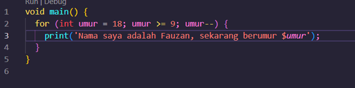
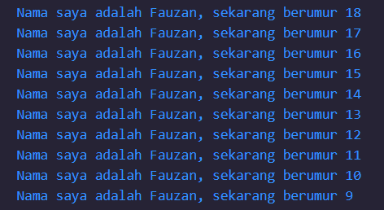

# laporan jobsheet #
Muhammad Khasbul Hadi Fauzan
3E / Sistem Informasi Bisnis
2241760039 / 18

Tugas praktikum

Soal 1

Soal 2
Mengapa sangat penting untuk memahami bahasa pemrograman Dart sebelum kita menggunakan framework Flutter ? Jelaskan! 
Karena kita tentu harus mengetahui Bahasa nativenya terlebih dahulu sebelum lebih mengenal frameworknya. Agar lebih mudah kedepannya

Soal 3
Rangkumlah materi dari codelab ini menjadi poin-poin penting yang dapat Anda gunakan untuk membantu proses pengembangan aplikasi mobile menggunakan framework Flutter.
1.	Bahasa dart adalah inti dari framework flutter.framework untuk membuat aplikasi seluler yang dapat diakses

2.	Dart bertujuan untuk menggabungkan kelebihan-kelebihan dari sebagian besar bahasa tingkat tinggi dengan fitur-fitur bahasa pemrograman terkini, antara lain sebagai berikut:
•	Productive tooling: merupakan fitur kakas (tool) untuk menganalisis kode, plugin IDE, dan ekosistem paket yang besar.
•	Garbage collection: untuk mengelola atau menangani dealokasi memori (terutama memori yang ditempati oleh objek yang tidak lagi digunakan).
•	Type annotations (opsional): untuk keamanan dan konsistensi dalam mengontrol semua data dalam aplikasi.
•	Statically typed: Meskipun type annotations bersifat opsional, Dart tetap aman karena menggunakan fitur type-safe dan type inference untuk menganalisis types saat runtime. Fitur ini penting untuk menemukan bug selama kompilasi kode.
•	Portability: bahasa Dart tidak hanya untuk web (yang dapat diterjemahkan ke JavaScript) tetapi juga dapat dikompilasi secara native ke kode Advanced RISC Machines (ARM) dan x86.
3.	Dart diluncurkan pada 2011, awalnya berfokus pada pengembangan web untuk menggantikan JavaScript. Namun, sejak 2018, Dart beralih ke pengembangan mobile, terutama dengan Flutter. Bahasa ini dirancang untuk memberikan performa tinggi, stabilitas, dan alat pengembangan modern, terutama untuk proyek besar. Dengan type annotations opsional dan fitur OOP, Dart seimbang antara fleksibilitas dan ketangguhan. Dart terus berkembang sebagai bahasa lintas platform yang modern dan fleksibel, yang menjadi alasan utama dipilihnya oleh tim Flutter.

4.	Dart dapat dieksekusi melalui dua cara: Dart Virtual Machine (VM) dan JavaScript compilation. Eksekusi kode Dart dapat menggunakan dua mode: Just-In-Time (JIT) untuk kompilasi saat runtime, yang berguna dalam pengembangan dengan fitur seperti hot reload, dan Ahead-Of-Time (AOT) untuk performa lebih tinggi pada aplikasi siap produksi. Dart mendukung lintas platform dengan menyediakan runtime systems, core libraries, dan garbage collectors. Fitur unggulannya, seperti hot reload, memungkinkan pengembangan lebih cepat dan umpan balik instan selama pengembangan aplikasi.

5.	Dart memiliki struktur yang mirip dengan bahasa pemrograman seperti C atau JavaScript, dengan sintaks yang mudah dipahami. Bahasa ini berorientasi objek (OO), mendukung fitur seperti encapsulation, inheritance, dan polymorphism, mirip dengan bahasa OO lainnya.

Operator Dart, termasuk aritmatika, increment, decrement, dan logika, bekerja seperti di bahasa lain, tetapi Dart tidak membedakan tipe data primitif. Setiap tipe adalah turunan dari class, sehingga operator bisa diubah sesuai logika. Dart mendukung operasi aritmatika (+, -, *, /, ~/), relasional (==, !=, <, >), dan logika (!, ||, &&), dengan dukungan penuh terhadap type safety, tanpa perlu operator seperti `===` di JavaScript.
