# laporan jobsheet #
Muhammad Khasbul Hadi Fauzan
3E / Sistem Informasi Bisnis
2241760039 / 18

Tugas praktikum

## praktikum 1 

### langkah 1

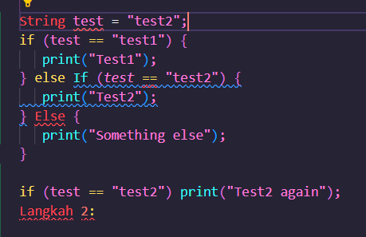

### langkah 2

disini terdapat kesalahan pada else if dikarenakan menggunakan huruf kapital pada if dan else menggunakan huruf kapital

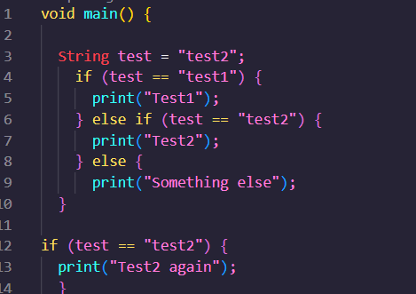

disini saya telah melakukan perbaikan pada else if dan else

### langkah 3

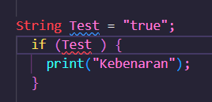

disini terdapat error dikarenakan variabel test terdapat diatas code yang diberikan dan pada variabel test bertipe string sedangkan pada perulangan if menggunakan boolean

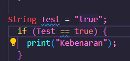

disini saya merubah kondisi if else dengan tipe data boolean

## praktikum 2

### langkah 1

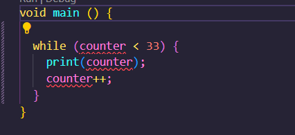

### langkah 2

terdapat error dikarenakan tidak ada pemanggilan variabel

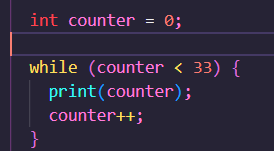

disini saya berhasil memanggil variabel dan berhasil

### langkah 3

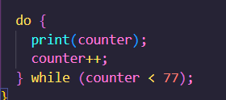

disini tidak terjadi error dikarenakan telah berhasil inisialisasi variabel

## praktikum 3

### langkah 1

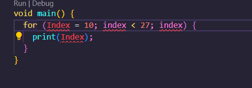

terjadi error karena belum ada inisialisasi variabel 

### langkah 2

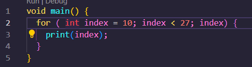

disini saya telah memperbaiki  dengan menambahkan variabel int pada index dan memperbaiki index dikarenakan ada index yang menggunakan kapital

### langkah 3

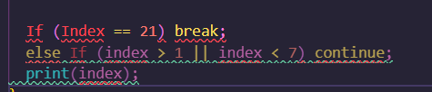

disini terdapat kesalahan pada index dikarenakan menggunakan huruf kapital dan else if tidak ada kurung kurawal

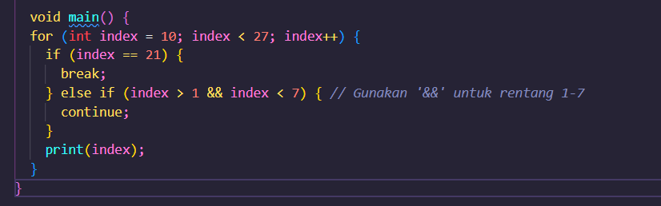

disini saya telah membetulkan baris code yang salah

## tugas praktikum 

### 2.  

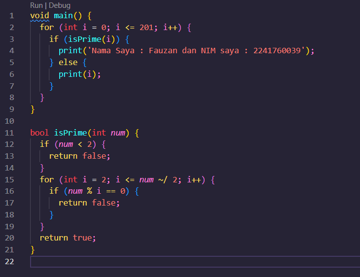

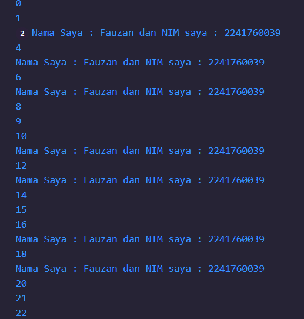